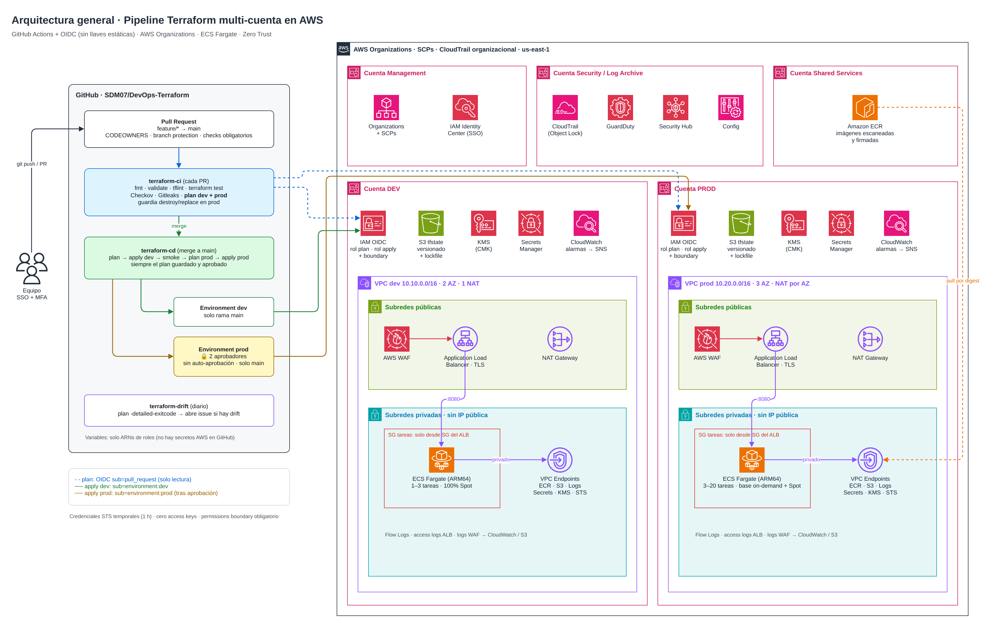

# Prueba técnica DevOps · Pipeline y arquitectura operativa para Terraform en AWS

Esta es una propuesta completa, con código que funciona, para:

1. **Validar** cambios de Terraform: fmt, validate, tflint, `terraform test`, Checkov, Gitleaks y plan.
2. **Aprobar** cambios: el plan se publica en el PR, CODEOWNERS revisa, una guardia bloquea destroy/replace en prod y prod tiene su propio paso de aprobación.
3. **Desplegar a dev y prod**: el mismo commit pasa primero por dev y luego por prod, y siempre se aplica el plan exacto que se aprobó.
4. **Integrar seguridad** en cada etapa: shift-left, pipeline y runtime.
5. **Manejar credenciales de AWS** sin llaves estáticas: GitHub OIDC → STS da credenciales temporales y los roles separan plan de apply.
6. **Soportar la aplicación** en **ECS Fargate**. La comparación con EC2 y EKS está justificada en la documentación.
7. **Escalar**: autoscaling por CPU, memoria y requests, varias AZ y Fargate Spot.
8. **Aplicar Zero Trust**: identidades efímeras, mínimo privilegio, microsegmentación y nada de IPs públicas en los workloads.

## Diagrama general



Diagrama editable en draw.io (3 páginas): [`docs/diagramas/arquitectura.drawio`](docs/diagramas/arquitectura.drawio)

## Estructura del repositorio

```
.
├── .github/
│   ├── workflows/
│   │   ├── terraform-ci.yml       # PR: validación estática + seguridad + plan (dev y prod)
│   │   ├── terraform-cd.yml       # main: plan/apply dev → smoke → plan prod → aprobación → apply prod
│   │   └── terraform-drift.yml    # diario: detecta cambios manuales y abre un issue
│   ├── actions/terraform-init/    # acción compuesta: setup + OIDC + init
│   ├── CODEOWNERS
│   ├── dependabot.yml
│   └── pull_request_template.md
├── terraform/
│   ├── bootstrap/                 # una vez por cuenta: bucket de estado + KMS + roles OIDC
│   ├── modules/
│   │   ├── github-oidc/           # roles plan/apply + permissions boundary
│   │   ├── network/               # VPC, subredes, NAT, VPC endpoints, flow logs
│   │   └── ecs-service/           # ECS Fargate + ALB + WAF + autoscaling + alarmas (+ tests)
│   └── envs/
│       ├── dev/                   # mismos módulos, valores de dev
│       └── prod/                  # mismos módulos, valores de prod
├── scripts/plan-guard.sh          # bloquea destroy/replace en prod y resume el plan
├── docs/                          # diagramas draw.io, arquitectura, respuestas, casos prácticos y guion del video
├── .tflint.hcl
└── .pre-commit-config.yaml
```

## Documentación

| # | Punto del video | Documento |
|---|---|---|
| 1 | Diagrama de arquitectura e infraestructura | [docs/01-arquitectura.md](docs/01-arquitectura.md) |
| 2 | Código Terraform y cómo se aprueban los cambios | [docs/02-pipeline-y-aprobaciones.md](docs/02-pipeline-y-aprobaciones.md) |
| 3 | Despliegue en DEV y luego en PROD | [docs/02-pipeline-y-aprobaciones.md#3-despliegue-dev--prod](docs/02-pipeline-y-aprobaciones.md#3-despliegue-dev--prod) |
| 4 | Estrategia de ramas, secretos y credenciales | [docs/03-ramas-secretos-credenciales.md](docs/03-ramas-secretos-credenciales.md) |
| 5 | Decisión EC2 / ECS / EKS | [docs/04-ec2-ecs-eks.md](docs/04-ec2-ecs-eks.md) |
| 6 | Cómo escalaría la solución | [docs/05-escalabilidad.md](docs/05-escalabilidad.md) |
| 7 | Controles de seguridad adicionales y Zero Trust | [docs/06-seguridad-zero-trust.md](docs/06-seguridad-zero-trust.md) |
| — | Casos prácticos 1, 2 y 3 | [docs/07-casos-practicos.md](docs/07-casos-practicos.md) |
| — | Guion del video | [docs/08-guion-video.md](docs/08-guion-video.md) |
| — | Puesta en marcha (paso a paso) | [docs/09-puesta-en-marcha.md](docs/09-puesta-en-marcha.md) |

## Validación local

```bash
terraform fmt -check -recursive terraform
for d in terraform/bootstrap terraform/envs/dev terraform/envs/prod; do
  terraform -chdir=$d init -backend=false && terraform -chdir=$d validate
done
terraform -chdir=terraform/modules/ecs-service init -backend=false
terraform -chdir=terraform/modules/ecs-service test        # 6 pruebas con proveedor simulado
tflint --init && tflint --recursive --chdir terraform
checkov -d terraform --framework terraform                  # 330 checks OK, 0 fallidos
```

> Los IDs de cuenta (`111111111111` dev, `222222222222` prod y `333333333333` shared services), el ARN del certificado y el digest de la imagen son **placeholders**. Hay que reemplazarlos al hacer la puesta en marcha.
