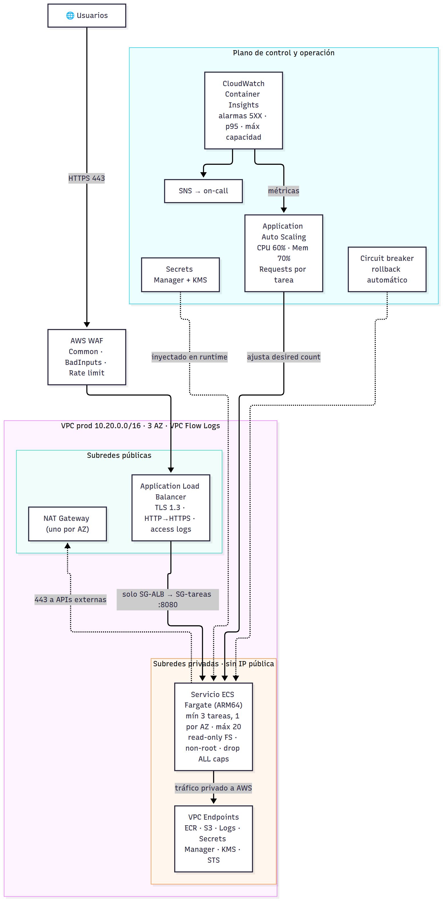
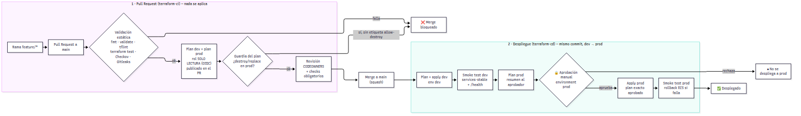

# 1. Arquitectura e infraestructura

Los diagramas están en código Mermaid (`docs/diagramas/*.mmd`), así que se versionan y se revisan en PR igual que el resto del repo. Las imágenes `.png` se generan con:

```bash
npx -p @mermaid-js/mermaid-cli mmdc -i docs/diagramas/01-arquitectura-general.mmd -o docs/diagramas/01-arquitectura-general.png -s 2
```

> Si prefieres otro programa para el video (draw.io, Excalidraw o Lucidchart), puedes importar el `.mmd` en draw.io (*Arrange → Insert → Advanced → Mermaid*) y aplicarle los íconos oficiales de AWS.

---

## 1.1 Vista general: GitHub → cuentas AWS


**Organización multi-cuenta (AWS Organizations):**

| Cuenta | Para qué sirve | Quién puede escribir |
|---|---|---|
| **Management** | Solo Organizations, SCPs, facturación e IAM Identity Center | Administradores, con MFA y break-glass |
| **Security / Log Archive** | CloudTrail de la organización, GuardDuty, Security Hub y Config agregados | Nadie la modifica desde el pipeline |
| **Shared Services** | ECR (imágenes), artefactos | Pipeline de la aplicación |
| **DEV** | Workload de desarrollo | Rol `gha-terraform-apply-dev` |
| **PROD** | Workload productivo | Rol `gha-terraform-apply-prod`, **solo después de una aprobación** |

Por qué multi-cuenta: la cuenta es el **límite de aislamiento más fuerte de AWS** (blast radius). Si se comprometen credenciales de dev, prod no se toca. Además permite SCPs distintas por entorno y separa la facturación.

**Estado de Terraform:** cada cuenta tiene su bucket S3 con versionado, cifrado KMS, acceso público bloqueado y TLS obligatorio. El bloqueo usa **lockfile nativo de S3** (`use_lockfile = true`, Terraform ≥ 1.10), así que ya no hace falta DynamoDB. El estado de prod nunca está en la cuenta de dev.

## 1.2 Runtime de la aplicación (ECS Fargate)



| Capa | Componente | Detalle |
|---|---|---|
| Borde | **AWS WAF** | Reglas administradas Common + KnownBadInputs (incluye Log4j) + rate limit por IP |
| Entrada | **ALB** | En subredes públicas, TLS 1.3, redirección HTTP→HTTPS, `drop_invalid_header_fields`, access logs a S3 |
| Cómputo | **ECS Fargate (ARM64/Graviton)** | En subredes privadas **sin IP pública**, filesystem read-only, usuario no root, `drop ALL` capabilities |
| Red | **SG → SG** | Las tareas solo aceptan tráfico del security group del ALB, en el puerto de la app |
| Salida privada | **VPC Endpoints** | ECR, S3, Logs, Secrets Manager, KMS y STS: el tráfico hacia AWS no pasa por Internet |
| Salida externa | **NAT Gateway** | Uno por AZ en prod (sin punto único de falla), uno compartido en dev (ahorro) |
| Secretos | **Secrets Manager + KMS** | ECS los inyecta como variables al arrancar la tarea; nunca pasan por Terraform |
| Resiliencia | **Circuit breaker** | Un despliegue que no se estabiliza vuelve solo a la versión anterior |
| Escalado | **Application Auto Scaling** | Target tracking por CPU, memoria y requests por tarea |
| Observabilidad | **CloudWatch** | Container Insights, VPC Flow Logs, alarmas de 5XX, latencia p95 y capacidad máxima → SNS |

## 1.3 Diferencias dev y prod (mismo código, distintos valores)

| Parámetro | dev | prod |
|---|---|---|
| AZs | 2 | 3 |
| NAT Gateway | 1 compartido | 1 por AZ |
| Tareas mín / máx | 1 / 3 | 3 / 20 |
| CPU / memoria por tarea | 0.25 vCPU / 512 MiB | 0.5 vCPU / 1 GiB |
| Capacidad | 100 % Fargate Spot | 3 on-demand de base + excedente en Spot |
| TLS | HTTP (demo) | HTTPS con ACM |
| Imagen | tag `dev-latest` | **digest inmutable** `@sha256:…` |
| Retención de logs | 14 días | 365 días |
| ECS Exec (shell en contenedor) | habilitado | **deshabilitado** |
| Protección contra borrado del ALB | no | sí |

Las dos carpetas `envs/dev` y `envs/prod` llaman **a los mismos módulos**. Lo único que cambia es `terraform.tfvars`, así que lo que se probó en dev es exactamente lo que llega a prod.

## 1.4 Flujo del pipeline



El detalle está en [02-pipeline-y-aprobaciones.md](02-pipeline-y-aprobaciones.md).
